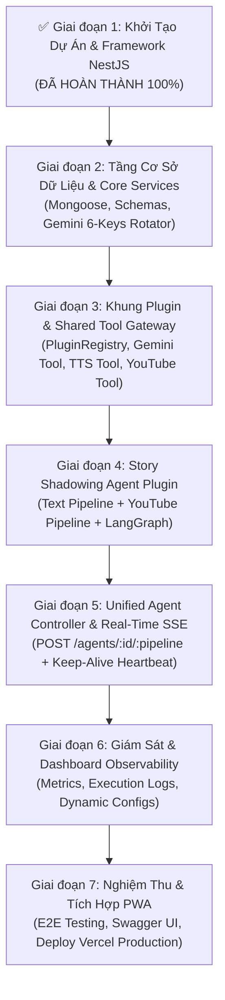

# Kế Hoạch Triển Khai Hệ Thống aha-mind-agents (v2 - Pragmatic Hybrid)

Hệ thống Backend độc lập quản lý, điều phối và thực thi Multi-Agent Workflows theo mô hình **Plugin Architecture**, tối ưu hóa cho **Vercel Serverless + Direct SSE Streaming** (không phụ thuộc Redis/Worker ban đầu, sẵn sàng mở rộng khi cần).

---

## 1. Điểm Khác Biệt Giữa v1 (Full Hybrid) và v2 (Pragmatic Hybrid)

> [!NOTE]
> Bản kế hoạch v1 (Full Hybrid với BullMQ + Redis + Railway Worker) đã được lưu trữ an toàn tại [docs/implementation_plan_v1_full-hybrid.md](file:///Users/anhtus/Documents/Development/NestJS/aha-mind-agents/docs/implementation_plan_v1_full-hybrid.md) để tra cứu bất cứ lúc nào.

* **Kiến trúc v2:** Chạy trực tiếp In-Process trên Vercel Serverless kết hợp NestJS RxJS Observable SSE với cơ chế **Keep-Alive Heartbeat** (Ping mỗi 15s) và `maxDuration = 300s`.
* **Ưu thế:** Tiết kiệm chi phí hạ tầng (0đ phát sinh), triển khai nhanh gấp 3 lần, loại bỏ hoàn toàn rủi ro kết nối giữa Gateway $\leftrightarrow$ Redis $\leftrightarrow$ Worker.
* **Khả năng mở rộng:** Cấu trúc theo chuẩn **Plugin Architecture** (Core $\rightarrow$ Plugins $\rightarrow$ Tools). Khi cần scale lên hàng trăm user đồng thời, chỉ cần cắm thêm `QueueAdapter` mà không sửa đổi một dòng logic Agent nào!

---

## 2. Các Giai Đoạn Triển Khai Chi Tiết



---

### Giai đoạn 1: Khởi Tạo Dự Án & Bộ Khung Framework (ĐÃ HOÀN THÀNH)
- [x] Khởi tạo `package.json`, `tsconfig.json`, `nest-cli.json`, `.gitignore`.
- [x] Xây dựng cơ chế kiểm tra biến môi trường Fail-fast với Zod trong [env.validation.ts](file:///Users/anhtus/Documents/Development/NestJS/aha-mind-agents/src/common/config/env.validation.ts).
- [x] Xây dựng [HealthController](file:///Users/anhtus/Documents/Development/NestJS/aha-mind-agents/src/api/health/health.controller.ts) (`GET /api/health`).
- [x] Cấu hình Swagger UI với CDN Assets chống crash trên Vercel Serverless.
- [x] Tạo Vercel Serverless Entrypoint [api/index.ts](file:///Users/anhtus/Documents/Development/NestJS/aha-mind-agents/api/index.ts) & [vercel.json](file:///Users/anhtus/Documents/Development/NestJS/aha-mind-agents/vercel.json).
- [x] 100% Unit Tests & E2E Tests vượt qua.

---

### Giai đoạn 2: Tầng Cơ Sở Dữ Liệu & Core Services
- [x] **Task 2.1:** Xây dựng `DatabaseModule` kết nối MongoDB Atlas qua Mongoose với Connection Pooling tối ưu cho Serverless.
- [x] **Task 2.2:** Định nghĩa Schema `Storybook` (collection `storybooks` trên DB `aha-tools` - tương thích 100% với PWA).
- [x] **Task 2.3:** Định nghĩa Schemas Quản Trị trên DB `aha-mind`:
  - `AgentExecLog`: Ghi vết lịch sử thực thi, timeline các node, token usage và chi phí.
  - `AgentConfig`: Lưu trữ System Prompt và Model cấu hình động.
- [x] **Task 2.4:** Xây dựng `GeminiRotatorService`: Quản lý và tự động luân phiên 6 Google Gemini API Keys với Rate Limiting & Failover.

---

### Giai đoạn 3: Khung Plugin & Shared Tool Gateway
- [x] **Task 3.1:** Định nghĩa `AgentPlugin` Interface Contract ([src/core/plugin.interface.ts](file:///Users/anhtus/Documents/Development/NestJS/aha-mind-agents/src/core/plugin.interface.ts)).
- [x] **Task 3.2:** Xây dựng `PluginRegistryService` cho phép tự động khám phá và đăng ký các Agent Plugin.
- [x] **Task 3.3:** Xây dựng Tầng Công Cụ Dùng Chung (Shared Tool Gateway):
  - `GeminiTool`: Wrapper gọi Gemini Chat & Structured Output với tính năng tự động chuyển Key khi dính Quota.
  - `TtsTool`: Tích hợp Google Cloud TTS sinh audio base64.
  - `YouTubeTool`: Tải phụ đề video và metadata từ YouTube.
  - `ScraperTool`: Thu thập và làm sạch văn bản bài báo từ URL bằng Cheerio / Readability.

---

### Giai đoạn 4: Story Shadowing Agent Plugin
- [ ] **Task 4.1:** Cấu trúc Plugin [src/plugins/story-shadowing/](file:///Users/anhtus/Documents/Development/NestJS/aha-mind-agents/src/plugins/story-shadowing/).
- [ ] **Task 4.2:** Porting **Text Pipeline** (LangGraph State Machine):
  - `sentenceSplitterNode`: Phân tách câu + phiên âm IPA.
  - `ttsGeneratorNode`: Tạo audio Text-to-Speech.
  - `keywordIdentifierNode` & `keywordEnricherNode`: Nhận diện từ vựng CEFR và tra cứu collocations.
- [ ] **Task 4.3:** Porting **YouTube Pipeline**:
  - `youtubeTranscriptFetcherNode`: Tải phụ đề.
  - `youtubeSentenceConsolidatorNode`: Ghép câu thông minh và căn chỉnh mốc thời gian (startMs/endMs).
- [ ] **Task 4.4:** Đóng gói thành `StoryShadowingPlugin` tuân thủ `AgentPlugin` interface, trả về `Observable<ProgressEvent>`.

---

### Giai đoạn 5: Unified Agent Controller & Real-Time SSE Gateway
- [ ] **Task 5.1:** Xây dựng `AgentsController` với endpoint hợp nhất:
  - `POST /api/agents/:agentId/:pipeline`
- [ ] **Task 5.2:** Xây dựng RxJS SSE Streaming Operator với cơ chế **Keep-Alive Heartbeat**:
  - Tự động phát event `ping` mỗi 15 giây nếu LangGraph đang chạy node nặng $\rightarrow$ Giữ kết nối Vercel luôn sống (No Timeout).
  - Stream chi tiết từng event tiến độ: `init`, `step_start`, `step_complete`, `done`, `error`.
- [ ] **Task 5.3:** Tự động lưu kết quả vào Collection `storybooks` ngay khi pipeline hoàn thành.

---

### Giai đoạn 6: Giám Sát & Dashboard Observability API
- [ ] **Task 6.1:** `GET /api/dashboard/metrics`: Thống kê tổng số lượt chạy, tỉ lệ thành công, thời gian xử lý trung bình và tổng token tiêu thụ.
- [ ] **Task 6.2:** `GET /api/dashboard/logs`: Xem lịch sử chi tiết từng lần chạy kèm timeline các node.
- [ ] **Task 6.3:** `GET /api/dashboard/plugins`: Liệt kê danh sách các Plugin đang hoạt động trên hệ thống.
- [ ] **Task 6.4:** `GET/PUT /api/dashboard/configs/:agentId`: Quản lý prompt và model động không cần redeploy code.

---

### Giai đoạn 7: Nghiệm Thu & Tích Hợp Với aha-tools PWA
- [ ] **Task 7.1:** Viết Unit Tests & Integration Tests toàn diện cho Plugin và Gateway.
- [ ] **Task 7.2:** Chạy kiểm thử End-to-End với văn bản thực tế và link YouTube thực tế.
- [ ] **Task 7.3:** Cập nhật Swagger API Docs đầy đủ schema request/response.
- [ ] **Task 7.4:** Deploy lên Vercel Production và nghiệm thu thực tế.

---

## 3. Kế Hoạch Xác Minh (Verification Plan)

### Kiểm Thử Tự Động (Automated Tests)
- `npm run test`: Kiểm tra logic toàn bộ Services, Tools và State Reducers.
- `npm run test:e2e`: Kiểm tra gọi API `POST /api/agents/story-shadowing/text` và hứng dữ liệu SSE stream trả về 200 OK.
- `npm run build`: Đảm bảo 0 lỗi TypeScript khi biên dịch sang `dist/`.

### Kiểm Thử Thủ Công (Manual Verification)
1. Dùng curl hoặc Postman gọi endpoint SSE:
   ```bash
   curl -N -X POST http://localhost:3001/api/agents/story-shadowing/text \
     -H "Content-Type: application/json" \
     -d '{"text": "The quick brown fox jumps over the lazy dog.", "voice": "en-US-Journey-F"}'
   ```
2. Quan sát dòng sự kiện SSE trả về liên tục (kèm ping heartbeat).
3. Kiểm tra bài học mới xuất hiện ngay lập tức trong MongoDB và PWA `aha-tools`.

---
*Made by Anh Tu - Share to be share*
