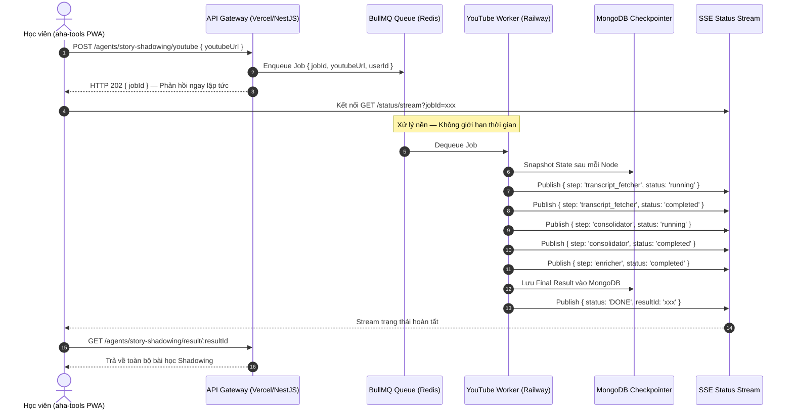

# Kế Hoạch Triển Khai aha-mind:agents
## Kiến Trúc: NestJS (Vercel) + BullMQ Worker (Railway) + MongoDB + LangGraph + Dashboard

---

## 1. Tóm Tắt & Phạm Vi

Hệ thống **`aha-mind:agents`** được thiết kế theo **5 tầng kiến trúc Production-Ready Agentic System** chuẩn mực, đảm nhận 100% nghiệp vụ Agent đang phân tán trong `aha-tools`, hoạt động theo mô hình **Hybrid Deployment**:

- **API Gateway (NestJS):** Deploy trên Vercel Serverless — nhận request, trả JobID ngay lập tức, stream trạng thái job về Client qua SSE.
- **Background Worker Pool:** Deploy trên Railway/Render Container — nhận Job từ Queue, chạy LangGraph Graph dài hạn không giới hạn thời gian.

---

## 2. Phạm Vi Nghiệp Vụ (100% Business Coverage từ aha-tools)

| Agent Engine | Pipeline | Endpoint Tương Ứng | Loại Xử Lý |
| :--- | :--- | :--- | :--- |
| Story Shadowing | Text Processing | `POST /agents/story-shadowing/process` | Long-running Worker (30-60s) |
| Story Shadowing | YouTube Pipeline | `POST /agents/story-shadowing/youtube` | Long-running Worker (60-120s) |
| Story Shadowing | Segment Suggester | `POST /agents/story-shadowing/suggest-segments` | Quick (~10s) |
| Story Shadowing | Series Creator | `POST /agents/story-shadowing/create-series` | Long-running Worker |
| Opta Predictor | Match Analysis & Prediction | `POST /agents/opta/predict` | Long-running Worker (30-60s) |
| First Agent | Dynamic Tool Routing | `POST /agents/general/run` | Quick (~5-10s) |

---

## 3. Kiến Trúc 5 Tầng (Architecture Layers)

```
┌────────────────────────────────────────────────────────────────┐
│         TẦNG 1: CLIENT / UI (aha-tools PWA + Admin Dashboard)  │
└────────────────────────────┬───────────────────────────────────┘
                             │ HTTP / SSE
┌────────────────────────────▼───────────────────────────────────┐
│    TẦNG 2: API GATEWAY (NestJS → Deploy trên Vercel)           │
│  - AgentsController: nhận Job, trả JobID (202 Accepted)        │
│  - StatusController: SSE stream trạng thái job                 │
│  - DashboardController: REST API phục vụ Dashboard Admin       │
└────────────────────────────┬───────────────────────────────────┘
                             │ BullMQ Job Queue (Redis)
┌────────────────────────────▼───────────────────────────────────┐
│    TẦNG 3: BACKGROUND WORKER LAYER (Deploy trên Railway)       │
│  - StoryShadowingWorker: Text + YouTube + Series Pipelines     │
│  - OptaPredictorWorker: Data Fetch + Stats + Predict           │
│  - GeneralAgentWorker: Tool Routing + Vocab Agent              │
└──────┬──────────────────┬──────────────────────┬──────────────┘
       │                  │                      │
┌──────▼──────┐  ┌────────▼────────┐  ┌──────────▼─────────────┐
│  TẦNG 4a:   │  │   TẦNG 4b:      │  │      TẦNG 5:           │
│ Checkpointer│  │  Long-term      │  │   Tool Gateway Layer   │
│ (Short-term)│  │  Store          │  │  (Cách ly Tool Calls)  │
│  MongoDB    │  │  MongoDB        │  │  Gemini AI / TTS /     │
│ (per-step   │  │  (User prefs,   │  │  Cheerio / ReadAbility │
│  snapshots) │  │   session hist) │  │  / YouTube Transcript  │
└─────────────┘  └─────────────────┘  └────────────────────────┘
```

---

## 4. Thiết Kế Cấu Trúc Thư Mục Chuẩn Hóa

```
aha-mind-agents/
├── src/
│   ├── main.ts
│   ├── app.module.ts
│   │
│   ├── api/                          # Tầng 2: API Gateway Layer
│   │   ├── agents/
│   │   │   ├── agents.controller.ts  # POST nhận job, trả JobID
│   │   │   ├── agents.module.ts
│   │   │   └── dto/
│   │   │       ├── story-shadowing.dto.ts
│   │   │       └── opta-predict.dto.ts
│   │   ├── status/
│   │   │   └── status.controller.ts  # @Sse: stream job progress
│   │   └── dashboard/
│   │       └── dashboard.controller.ts
│   │
│   ├── workers/                      # Tầng 3: Background Worker Layer
│   │   ├── story-shadowing.worker.ts
│   │   ├── opta-predictor.worker.ts
│   │   └── general-agent.worker.ts
│   │
│   ├── core/                         # Logic thuần — không phụ thuộc NestJS
│   │   ├── graph/
│   │   │   ├── story-shadowing/
│   │   │   │   ├── graph.ts
│   │   │   │   ├── state.ts
│   │   │   │   ├── youtube-graph.ts
│   │   │   │   └── nodes/
│   │   │   │       ├── sentence-splitter.node.ts
│   │   │   │       ├── tts-generator.node.ts
│   │   │   │       ├── keyword-identifier.node.ts
│   │   │   │       ├── keyword-enricher.node.ts
│   │   │   │       ├── youtube-transcript-fetcher.node.ts
│   │   │   │       ├── youtube-sentence-consolidator.node.ts
│   │   │   │       └── youtube-segment-suggester.node.ts
│   │   │   └── opta/
│   │   │       ├── graph.ts
│   │   │       ├── state.ts
│   │   │       └── nodes/
│   │   │           ├── data-fetcher.node.ts
│   │   │           ├── stats-analyzer.node.ts
│   │   │           ├── expert-opinion.node.ts
│   │   │           └── predictor.node.ts
│   │   │
│   │   ├── tools/                    # Tầng 5: Tool Gateway Layer
│   │   │   ├── tts.tool.ts           # Google TTS abstraction
│   │   │   ├── gemini.tool.ts        # Gemini API gateway
│   │   │   ├── scraper.tool.ts       # Cheerio / Readability
│   │   │   └── youtube.tool.ts       # youtube-transcript wrapper
│   │   │
│   │   └── state.ts                  # Shared State Schemas (Zod)
│   │
│   ├── infra/                        # Tầng 4: Persistence & Memory
│   │   ├── database.module.ts        # MongoDB Atlas connection config
│   │   ├── checkpointer/
│   │   │   └── mongo-checkpointer.ts # LangGraph Checkpointer per-step
│   │   └── store/
│   │       └── long-term-store.ts    # Cross-session memory store
│   │
│   └── common/                       # Utilities dùng chung
│       ├── interceptors/
│       │   └── agent-logger.interceptor.ts
│       └── schemas/
│           └── agent-execution-log.schema.ts
│
├── api/
│   └── index.ts                      # Vercel Serverless Entry Point
│
└── vercel.json                       # Vercel routing & maxDuration config
```

---

## 5. Thiết Kế Luồng Dữ Liệu (Data Flow) — Trường Hợp YouTube Pipeline



---

## 6. Thiết Kế Schema MongoDB

### 6a. AgentExecutionLog (Tracing & Analytics)

```typescript
{
  jobId: string,
  agentId: 'story-shadowing' | 'opta' | 'general',
  pipelineType: 'text' | 'youtube' | 'predict',
  userId: string,
  status: 'QUEUED' | 'RUNNING' | 'SUCCESS' | 'FAILED',
  queuedAt: Date,
  startedAt: Date,
  completedAt: Date,
  durationMs: number,
  tokenUsage: {
    promptTokens: number,
    completionTokens: number,
    totalTokens: number,
    estimatedCostUsd: number
  },
  nodeTraces: [{
    nodeName: string,
    startedAt: Date,
    durationMs: number,
    status: 'COMPLETED' | 'ERROR',
    errorDetail?: string
  }],
  error?: { message: string, stack: string }
}
// Index: { createdAt: -1, agentId: 1 } + TTL 90 ngày
```

### 6b. AgentJobResult (Kết Quả Xử Lý)

```typescript
{
  jobId: string,
  agentId: string,
  result: any,       // Structured Output tương ứng từng Agent
  createdAt: Date,
  expiresAt: Date    // TTL: 7 ngày
}
```

### 6c. AgentConfig (Dynamic Prompt & Model Config)

```typescript
{
  agentId: string,
  model: 'gemini-2.0-flash' | 'gemini-2.0-pro',
  systemPrompt: string,
  temperature: number,
  isActive: boolean,
  updatedAt: Date,
  updatedBy: string
}
```

---

## 7. Cấu Hình Deploy (Hybrid Deployment Strategy)

### Vercel (API Gateway — NestJS)

```json
{
  "version": 2,
  "rewrites": [
    { "source": "/api/(.*)", "destination": "/api/index.ts" },
    { "source": "/dashboard", "destination": "/api/index.ts" }
  ],
  "functions": {
    "api/index.ts": { "maxDuration": 30 }
  }
}
```

### Railway (Background Worker — Persistent Container)

- Chạy Worker Process liên tục (Non-HTTP persistent container).
- Environment Variables: `REDIS_URL`, `MONGODB_URI`, `GOOGLE_API_KEY`, `GOOGLE_TTS_KEY`.
- Horizontal scaling: Thêm Worker instance khi Job Queue tăng.

---

## 8. Built-in Dashboard Admin (3 Màn Hình Chính)

Dashboard UI phục vụ qua NestJS tại `/dashboard`:

1. **Overview Metrics:**
   - KPI Cards: Total Runs / Avg Latency / Success Rate (%) / Est. Token Cost (USD/tháng).
   - Biểu đồ: Token Consumption theo ngày (7/30 ngày), Agent Usage Distribution.

2. **Trace Explorer:**
   - Bảng danh sách Jobs (sortable: thời gian, agent, trạng thái).
   - Drill-down: Click Job xem timeline từng Node và error stacktrace chi tiết.

3. **Agent Config Manager:**
   - Điều chỉnh System Prompt, chọn Model (Flash vs Pro) theo từng Agent.
   - Toggle bật/tắt Agent mà không cần deploy lại.

---

## 9. Kế Hoạch Triển Khai Từng Bước (Execution Checklist)

### [Giai đoạn 1] Scaffold & Infrastructure Setup (~2-3 ngày)
- [ ] Khởi tạo dự án NestJS tại `aha-mind-agents/`
- [ ] Cài đặt toàn bộ dependencies (NestJS, BullMQ, Mongoose, LangChain, Zod, RxJS)
- [ ] Cấu hình `DatabaseModule` kết nối MongoDB Atlas (Serverless-safe connection pooling)
- [ ] Cấu hình `BullMQModule` kết nối Redis (Upstash hoặc Railway Redis)
- [ ] Tạo `api/index.ts` Vercel Serverless Entry Point với Singleton NestJS Cache
- [ ] Tạo `vercel.json` và kiểm thử routing cục bộ

### [Giai đoạn 2] Observability & Logging Layer (~1-2 ngày)
- [ ] Tạo Mongoose Schemas: `AgentExecutionLog`, `AgentJobResult`, `AgentConfig`
- [ ] Xây dựng `AgentLoggerInterceptor` (ghi log bất đồng bộ qua EventEmitter2)
- [ ] Xây dựng `LogService` và `AnalyticsService` với MongoDB Aggregation Pipelines

### [Giai đoạn 3] Core Agent Engine — Port từ aha-tools (~3-4 ngày)
- [ ] Port & chuẩn hóa 7 Nodes của Story Shadowing Engine
- [ ] Port & chuẩn hóa 4 Nodes của Opta Predictor Engine
- [ ] Xây dựng Tool Gateway Layer: `tts.tool`, `gemini.tool`, `scraper.tool`, `youtube.tool`
- [ ] Xây dựng MongoDB Checkpointer cho LangGraph (per-step snapshot)
- [ ] Tích hợp Workers: `StoryShadowingWorker`, `OptaWorker`, `GeneralAgentWorker`

### [Giai đoạn 4] API Layer & SSE Status Stream (~2 ngày)
- [ ] Xây dựng `AgentsController`: POST endpoints nhận Job, trả HTTP 202 + JobID
- [ ] Xây dựng `StatusController`: `@Sse('/status/stream')` subscribe Redis Pub/Sub
- [ ] Xây dựng DTOs với Zod validation cho tất cả input/output
- [ ] Xây dựng `ResultController`: GET kết quả sau khi Job hoàn thành

### [Giai đoạn 5] Dashboard UI (~2-3 ngày)
- [ ] Xây dựng Dashboard SPA (React + Tailwind, phục vụ qua NestJS `/dashboard`)
- [ ] Implement 3 màn hình: Overview Metrics, Trace Explorer, Agent Config Manager

### [Giai đoạn 6] Integration & Deploy (~2 ngày)
- [ ] Cập nhật `aha-tools`: Thay thế gọi nội bộ `lib/agents` → gọi `aha-mind:agents` API
- [ ] Deploy API Gateway lên Vercel
- [ ] Deploy Background Worker lên Railway
- [ ] Kiểm thử End-to-End toàn bộ 6 pipeline nghiệp vụ

---

## 10. Verification Plan (Kế Hoạch Nghiệm Thu)

| Test Case | Mô tả | Kết quả kỳ vọng |
| :--- | :--- | :--- |
| TC-01: Text Shadowing | POST văn bản → nhận JobID → SSE stream 4 bước → GET result | Đầy đủ sentences, audio, IPA, keywords |
| TC-02: YouTube Shadowing | POST URL → nhận JobID → SSE stream → GET result | Chuỗi câu có timestamps chính xác |
| TC-03: Opta Prediction | POST match info → nhận phân tích + tỷ số dự đoán | Output tương đương hiện tại trên aha-tools |
| TC-04: Timeout Resilience | Giả lập mạng yếu → Worker vẫn hoàn tất → Client reconnect SSE | Job không bị mất dữ liệu |
| TC-05: Dashboard Metrics | Sau TC-01,02,03 → mở `/dashboard` | Hiển thị đúng số lượt, latency, token usage |
| TC-06: Vercel Cold Start | Gọi API ngay sau Deploy mới | Phản hồi 202 trong < 3 giây |

---
*Made by Anh Tu - Share to be share*
