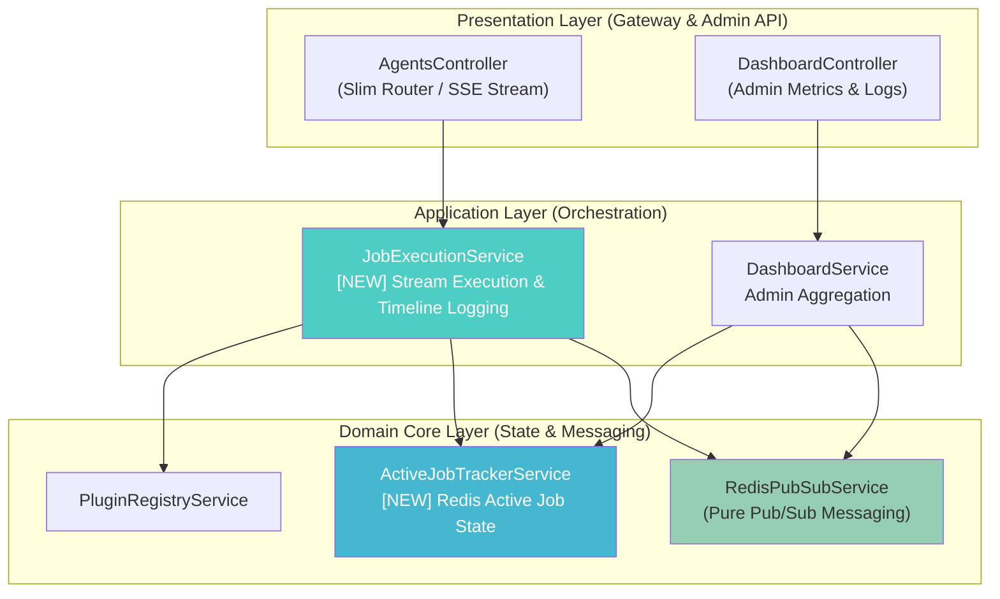

# 🛠️ Implementation Plan: Sửa lỗi Vercel Build & Tái cấu trúc Redis Pub/Sub Architecture

Tài liệu này trình bày kế hoạch kỹ thuật chi tiết để **sửa dứt điểm các lỗi build TypeScript trên Vercel** và **tái cấu trúc (refactor) hệ thống Redis Pub/Sub** theo đúng các nguyên tắc thiết kế phần mềm (SRP, Decoupling, Performance Optimization).

---

## 🎯 Mục tiêu chính

1. **Sửa lỗi Vercel Build (Hotfix)**:
   - Xử lý xung đột kiểu dữ liệu giữa `@types/express` v5 và Vercel Serverless Function trong `api/index.ts`.
   - Khắc phục các lỗi ép kiểu `Response` / `Request` (`setHeader`, `write`, `end`, `on`) trong `src/api/agents/agents.controller.ts`.
2. **Sửa Bug Nghiêm trọng (Critical Bug Fix)**:
   - Loại bỏ việc gọi `plugin.execute()` 2 lần liên tiếp trong `agents.controller.ts` (gây nhân đôi tiến trình chạy ngầm).
3. **Refactor Cấu trúc Hệ thống (SRP & Decoupling)**:
   - Tách `RedisPubSubService` (đang ôm 4 trách nhiệm) thành 2 service chuyên biệt:
     - `RedisPubSubService`: Chỉ chịu trách nhiệm Pub/Sub messaging qua Redis.
     - `ActiveJobTrackerService`: Quản lý trạng thái Active Jobs trong Redis Hash + Set.
   - Tạo `JobExecutionService` để rút gọn "Fat Controller" `AgentsController`, chuyển toàn bộ orchestration logic xuống Service layer.
4. **Tối ưu hiệu năng Redis**:
   - Thay thế lệnh `KEYS *` (O(N) blocking) bằng `Redis SET` (O(1) tracking).
   - Thêm `.catch()` cho các cuộc gọi fire-and-forget `publishEvent`.

---

## 🏗️ Kiến trúc sau khi Refactor



---

## 🔍 Root Cause Analysis (Phân tích nguyên nhân gốc rễ)

### 1. Nguyên nhân lỗi Vercel Build
- **Hiện tượng**: Vercel báo lỗi `This expression is not callable. Type 'Express' has no call signatures` và `Property 'setHeader' / 'status' / 'write' / 'end' / 'on' does not exist on type 'Response/Request'`.
- **Nguyên nhân gốc rễ**: Dự án đang sử dụng `"express": "^5.2.1"` và `"@types/express": "^5.0.6"`. Trong `@types/express` v5, định nghĩa generic của `Response<ResBody, Locals>` và `Express` interface có sự thay đổi lớn so với Express v4. Khi build trên Vercel, trình biên dịch TypeScript chạy dưới môi trường type checking nghiêm ngặt của `@vercel/node`, dẫn đến việc kiểu `Response` từ `express` không tự động kế thừa đầy đủ các phương thức của Node.js `http.ServerResponse`.
- **Giải pháp**: Ép kiểu an toàn (`res: any` hoặc `Response & any`, `(server as any)(req, res)`) tại các điểm giao tiếp HTTP trực tiếp với Express stream.

### 2. Bug `plugin.execute()` bị gọi 2 lần
- **Hiện tượng**: Trong `agents.controller.ts`, dòng 127 khai báo `const stream$ = plugin.execute(...)` bên ngoài khối try, sau đó dòng 165 lại khai báo lại `const stream$ = plugin.execute(...)` bên trong khối try.
- **Nguyên nhân gốc rễ**: Refactoring dở dang trước đó để lại khai báo thừa ở dòng 127. Mỗi lần gọi `execute()` sẽ khởi tạo pipeline runner mới.

---

## 📑 Chi tiết các thay đổi (Proposed Changes)

### Phase 1: Vercel Build Hotfix & Bug Fixes

#### [MODIFY] [api/index.ts](file:///Users/anhtus/Documents/Development/NestJS/aha-mind-agents/api/index.ts)
- Sửa ép kiểu `server` instance: `(server as any)(req, res)` để tránh lỗi TS2349 (`This expression is not callable`).
- Sửa `(res as any).status(500).json(...)` để xử lý triệt để TS2339.

#### [MODIFY] [agents.controller.ts](file:///Users/anhtus/Documents/Development/NestJS/aha-mind-agents/src/api/agents/agents.controller.ts)
- Sửa kiểu dữ liệu tham số `@Req() req: any`, `@Res() res: any` để khắc phục lỗi missing properties (`setHeader`, `flushHeaders`, `write`, `end`, `on`).
- Cắt bỏ khai báo thừa `const stream$ = plugin.execute(...)` tại dòng 127.

---

### Phase 2: Refactoring Redis & State Management Layer

#### [NEW] [active-job-tracker.service.ts](file:///Users/anhtus/Documents/Development/NestJS/aha-mind-agents/src/core/services/active-job-tracker.service.ts)
- Chuyển toàn bộ logic quản lý Redis Hash (`active_job:{jobId}`) từ `RedisPubSubService` sang service mới này.
- Thêm một `Redis SET` key (`active_jobs_set`) để theo dõi danh sách jobId đang hoạt động.
- Phương thức `getActiveJobs()` sẽ đọc danh sách ID từ `active_jobs_set` thay vì chạy `KEYS active_job:*` (khắc phục O(N) blocking performance issue).

#### [MODIFY] [redis-pubsub.service.ts](file:///Users/anhtus/Documents/Development/NestJS/aha-mind-agents/src/core/services/redis-pubsub.service.ts)
- Rút gọn service chỉ còn tập trung vào **1 nhiệm vụ duy nhất**: Khởi tạo Pub/Sub Redis clients và phát/nhận sự kiện qua `events$` (RxJS Subject).
- Loại bỏ các hàm `registerActiveJob`, `updateActiveJobStep`, `removeActiveJob`, `getActiveJobs`.

#### [MODIFY] [core.module.ts](file:///Users/anhtus/Documents/Development/NestJS/aha-mind-agents/src/core/core.module.ts)
- Đăng ký và export `ActiveJobTrackerService`.

---

### Phase 3: Application Layer & Slim Controller

#### [NEW] [job-execution.service.ts](file:///Users/anhtus/Documents/Development/NestJS/aha-mind-agents/src/api/agents/job-execution.service.ts)
- Đóng gói toàn bộ quy trình thực thi Job stream (Validate input, fetch agent config, register active job, publish events, handle RxJS stream subscription, record timeline & token usage, cleanup active job, save execution log to MongoDB).

#### [MODIFY] [agents.controller.ts](file:///Users/anhtus/Documents/Development/NestJS/aha-mind-agents/src/api/agents/agents.controller.ts)
- Chuyển `AgentsController` thành Router đơn giản (~50 dòng code): Ủy quyền xử lý cho `JobExecutionService`.

#### [MODIFY] [agents.module.ts](file:///Users/anhtus/Documents/Development/NestJS/aha-mind-agents/src/api/agents/agents.module.ts)
- Khai báo `JobExecutionService` trong list `providers`.

#### [MODIFY] [dashboard.service.ts](file:///Users/anhtus/Documents/Development/NestJS/aha-mind-agents/src/api/dashboard/dashboard.service.ts)
- Cập nhật `getLogs()` để inject và gọi `ActiveJobTrackerService.getActiveJobs()`.

---

## 🧪 Verification Plan (Kế hoạch kiểm thử)

### Automated Tests & Type Checking
1. **Kiểm tra TypeScript strict compilation**:
   ```bash
   npx tsc --noEmit -p tsconfig.json
   ```
2. **Kiểm tra NestJS Build**:
   ```bash
   npm run build
   ```

### Manual Verification
1. **Khởi chạy local dev server**:
   ```bash
   npm run start:dev
   ```
2. **Kiểm thử SSE API Stream**:
   Gửi request POST tới `http://localhost:3000/api/v1/agents/story-shadowing/text/stream` và kiểm tra luồng tin nhắn SSE trả về mượt mà, không bị lặp event.
3. **Kiểm thử Dashboard Active Jobs**:
   Kiểm tra endpoint `GET http://localhost:3000/api/v1/dashboard/logs` để đảm bảo active jobs được kết hợp chính xác với DB logs.

---

> [!IMPORTANT]
> Anh Tú hãy xem qua kế hoạch refactor này. Sau khi anh xác nhận đồng ý, em sẽ tiến hành tạo `task.md` và thực thi từng bước.

---

*Made by Anh Tu - Share to be shared*
