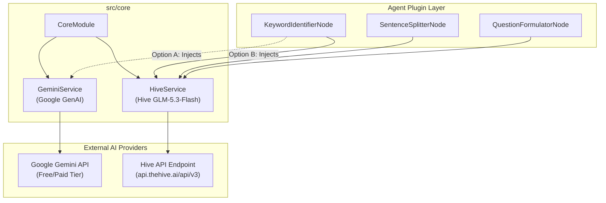

# Hive LLM Service Architectural Design

> **Tài liệu đặc tả kiến trúc:** Tích hợp Hive LLM Service (GLM-5.3-Flash) độc lập giải quyết bài toán HTTP 503 từ Gemini Service trong hệ thống `aha-mind-agents`.  
> **Tác giả:** Anh Tú  
> **Thời gian:** 2026-10-08  

---

## 1. Bối cảnh & Phân tích Nguyên nhân Gốc rễ (Root Cause Analysis)

### 1.1. Hiện trạng vấn đề
Hệ thống `aha-mind-agents` vận hành các chuỗi Agentic Workflow phức tạp (như Speaking Quiz, Story Shadowing), đòi hỏi gọi nhiều lượt LLM liên tiếp để phân tích ngôn ngữ, trích xuất cấu trúc và tổng hợp câu hỏi.
Hiện tại, tầng AI Core phụ thuộc vào `GeminiService` (sử dụng `@langchain/google-genai`).

Trong quá trình vận hành thực tế, hệ thống liên tục gặp lỗi **HTTP 503 Service Unavailable** từ phía Google Gemini. Dù `GeminiService` đã được trang bị cơ chế xoay vòng Key (`Key Rotation`), toàn bộ các key vẫn đồng loạt thất bại do lỗi 503 là lỗi quá tải hạ tầng cụm máy chủ vùng (Regional Server Overload) của Google chứ không phải do cạn kiệt Quota cục bộ của từng Key (429).

### 1.2. Mục tiêu kỹ thuật
Phát triển một dịch vụ LLM độc lập mới mang tên **`HiveService`** dựa trên nền tảng The Hive AI API (`https://api.thehive.ai/api/v3/chat/completions`):
* Mô hình sử dụng mặc định: `zai-org/glm-5.3-flash`.
* Kiến trúc: Độc lập (Pluggable Service), tuân thủ nguyên lý Liskov Substitution Principle (LSP).
* Hợp đồng giao tiếp (Contract): Tương thích hoàn toàn với interface của `GeminiService`, cho phép các Agent Node chuyển đổi giữa Gemini và Hive mà **không phải sửa đổi bất kỳ dòng logic nghiệp vụ nào**.

---

## 2. Đặc tả Kỹ thuật của Hive API & Model `zai-org/glm-5.3-flash`

Sau khi kiểm chứng thực nghiệm trực tiếp qua HTTP request với `HIVE_API_KEY`:

| Đặc tính | Chi tiết kỹ thuật | Lưu ý khi hiện thực |
| :--- | :--- | :--- |
| **Endpoint** | `POST https://api.thehive.ai/api/v3/chat/completions` | Tương thích chuẩn OpenAI Chat Completions. |
| **Headers** | `Authorization: Bearer <HIVE_API_KEY>`, `Content-Type: application/json` | Đọc an toàn từ `ConfigService` (`.env`). |
| **Bản chất Model** | **Reasoning Model (Mô hình suy luận)** | Trả về reasoning tokens trước khi đưa ra nội dung (`content`). |
| **Max Tokens** | Mặc định cần thiết lập `>= 2048` hoặc `4096` | Nếu đặt thấp (ví dụ 100), reasoning sẽ chiếm hết quota khiến `content: null` và `finish_reason: "length"`. |
| **Structured Output** | Hỗ trợ qua `response_format: { type: "json_object" }` | Cần kèm hướng dẫn schema trong `messages` và validate đầu ra bằng `zod`. |
| **Streaming** | Hỗ trợ qua `stream: true` (Server-Sent Events - SSE) | Stream lần lượt các chunk `reasoning`, sau đó đến `content`, kết thúc bằng `data: [DONE]`. |

---

## 3. Thiết kế Kiến trúc Hệ thống (System Architecture)

### 3.1. Sơ đồ khối tổng thể



### 3.2. Cấu trúc Thư mục

```text
src/
├── common/
│   └── config/
│       ├── env.validation.ts          <-- Thêm biến HIVE_API_KEY, HIVE_MODEL, HIVE_BASE_URL
│       └── env.validation.spec.ts     <-- Bổ sung test kiểm tra env schema
├── core/
│   ├── core.module.ts                 <-- Khai báo & export HiveService
│   ├── gemini/
│   │   └── ... (Giữ nguyên)
│   └── hive/
│       ├── hive.service.ts            <-- Dịch vụ chính tương tác với Hive API
│       ├── hive.service.spec.ts       <-- Unit test cho HiveService (Mock Axios)
│       └── hive.interface.ts          <-- Định nghĩa các kiểu dữ liệu, options, usage
```

---

## 4. Chi tiết Hợp đồng Giao tiếp (Interface Specification)

`HiveService` cung cấp 3 phương thức cốt lõi:

### 4.1. `invoke(messages, options)`
Gọi LLM ở chế độ Completion thông thường, trả về nội dung dạng chuỗi cùng metadata lượng token đã tiêu thụ.
* **Input:**
  * `messages`: Mảng tin nhắn `{ role: 'system' | 'user' | 'assistant', content: string }[]`.
  * `options`: `{ temperature?: number, maxTokens?: number, model?: string }`.
* **Output:**
  * `{ text: string, usage: { promptTokens: number, completionTokens: number, totalTokens: number }, reasoning?: string }`.

### 4.2. `invokeStructured<T>(schema, prompt, options)`
Phương thức quan trọng nhất dùng cho các Agent Node để trích xuất dữ liệu có cấu trúc.
* **Input:**
  * `schema`: Zod Schema (ví dụ `IdentifiedKeywordListSchema`, `GeminiSentenceListSchema`).
  * `prompt`: Chuỗi câu hỏi hoặc mảng tin nhắn `messages`.
  * `options`: `{ temperature?: number, model?: string, maxTokens?: number, name?: string }`.
* **Cơ chế hoạt động:**
  1. Tự động chuyển đổi hoặc nhúng cấu trúc JSON kỳ vọng vào prompt / system instructions.
  2. Kích hoạt `response_format: { type: 'json_object' }`.
  3. Gửi request đến Hive API với `max_tokens` dự phòng thích hợp (mặc định 4096).
  4. Trích xuất chuỗi JSON từ `choices[0].message.content`.
  5. Parse JSON và chạy qua `schema.parse(parsedJson)` để đảm bảo an toàn kiểu dữ liệu (Type Safety).
* **Output:**
  * `{ parsed: T, usage: { promptTokens: number, completionTokens: number, totalTokens: number } }`.

### 4.3. `invokeStream(messages, options)`
Hỗ trợ Server-Sent Events (SSE) streaming theo thời gian thực.
* **Input:** Tương tự `invoke`.
* **Output:** `AsyncGenerator<{ content?: string, reasoning?: string, isDone: boolean, usage?: any }>` cho phép consumer đọc từng chunk token khi nó được sinh ra.

---

## 5. Xử lý Lỗi & Khả năng Phục hồi (Error Handling & Resilience)

1. **Timeout Control:** Thiết lập timeout cho HTTP call (mặc định 60 giây do GLM-5.3 có bước suy luận).
2. **Fail-fast on Invalid JSON:** Nếu model trả về chuỗi JSON không đúng schema, bắt `ZodError` và log chi tiết đường dẫn lỗi (`err.path`).
3. **Environment Guard:** Nếu thiếu `HIVE_API_KEY`, ứng dụng cảnh báo rõ ràng trong log lúc khởi động.

---

## 6. Đánh đổi Kỹ thuật (Technical Trade-offs)

* **Ưu điểm:**
  * Không phát sinh dependency nặng trong dự án; dùng trực tiếp `axios` và `zod` đã có sẵn.
  * Tách biệt hoàn toàn với `GeminiService`, không rủi ro làm hỏng code đang chạy.
  * Tương thích 100% chữ ký hàm (`invokeStructured`) nên các Node cắm rút tức thì.
* **Đánh đổi:**
  * Model `zai-org/glm-5.3-flash` là reasoning model nên độ trễ (latency) của token đầu tiên (TTFT) có thể cao hơn Gemini Flash vài giây do bước suy luận ban đầu. Đổi lại, độ chính xác của cấu trúc JSON và khả năng bám sát ngữ cảnh rất cao.

---
*Made by Anh Tu - Share to be share*
