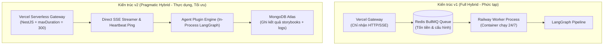
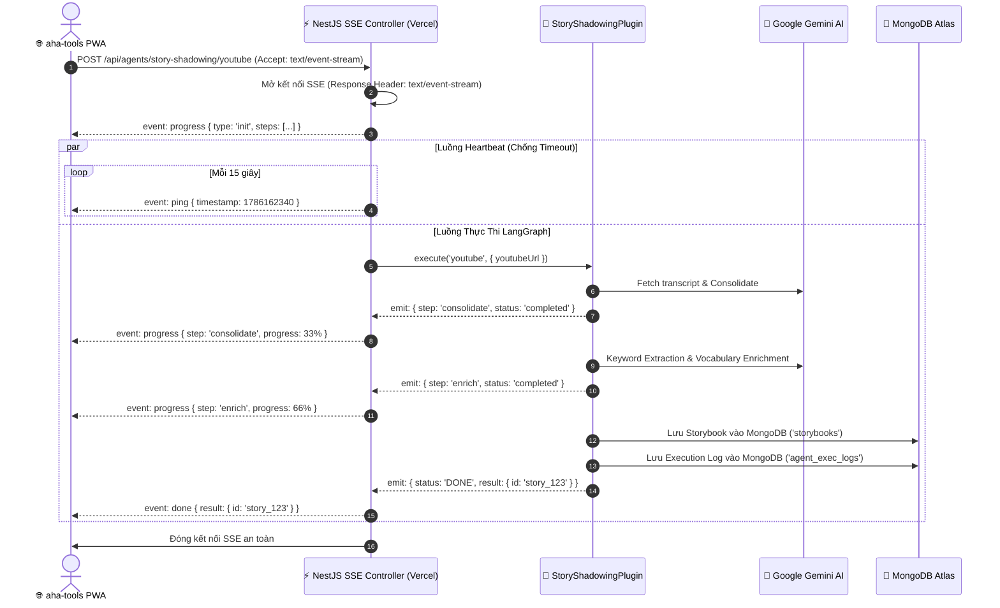
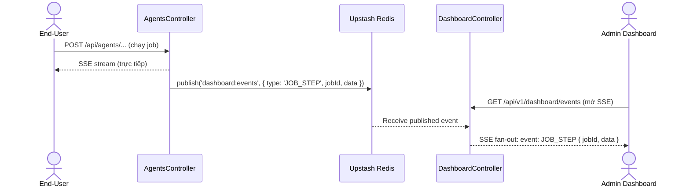
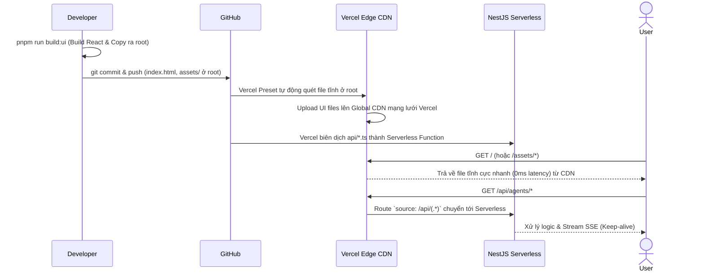

# System Design: aha-mind-agents (v2 - Pragmatic Hybrid Architecture)

> **Tài Liệu Kiến Trúc Kỹ Thuật (Technical Architecture Document)**
> Hệ thống Backend độc lập quản lý, điều phối và thực thi Multi-Agent Workflows
> theo mô hình **Plugin Architecture** tối ưu hóa cho **Vercel Serverless + Direct SSE Streaming (In-Process)**.
> Hỗ trợ **Real-time Observability** cho Admin Dashboard qua **Redis Pub/Sub (Upstash)** và **Gemini Rate Limiter** để phòng ngừa lỗi 429 Quota.

---

## 1. Tổng Quan Hệ Thống & Triết Lý Thiết Kế (System Overview)

### 1.1. Mục Tiêu Cốt Lõi

`aha-mind-agents` là **backend engine độc lập**, tách biệt hoàn toàn khỏi `aha-tools` PWA, chịu trách nhiệm:

1. Tiếp nhận và định tuyến các tác vụ Agent từ mọi Client (aha-tools PWA, Mobile, Admin Dashboard, Postman, v.v.).
2. Điều phối luồng làm việc thông minh (LangGraph State Machine) với Google Gemini AI & Google Cloud TTS.
3. Stream tiến độ theo thời gian thực (Real-time SSE with Keep-Alive Heartbeat) trực tiếp từ Vercel Serverless (chạy ổn định 5-7 phút không ngắt kết nối).
4. Chuẩn bị sẵn **Plugin Architecture** để khi lượng người dùng tăng đột biến, hệ thống có thể chuyển giao sang Queue/Worker (BullMQ + Redis) mà không phải viết lại code nghiệp vụ của các Agent.

### 1.2. So Sánh Hai Mô Hình Kiến Trúc (v1 vs v2)



| Tiêu Chí                                        | v1: Full Hybrid (Queue + Dedicated Worker)                             | v2: Pragmatic Hybrid (Vercel In-Process SSE)                               |
| :------------------------------------------------ | :--------------------------------------------------------------------- | :------------------------------------------------------------------------- |
| **Số lượng nền tảng hạ tầng**        | 3 nền tảng (Vercel + Redis Upstash + Railway)                        | **1 nền tảng duy nhất (Vercel)** + MongoDB Atlas                  |
| **Chi phí duy trì hàng tháng**          | Tốn phí Redis (~$5-10) + Container Railway (~$5-15)                 | **0 đồng phát sinh** (Tận dụng Vercel Serverless & Mongo Atlas) |
| **Thời gian triển khai (Time-to-Market)** | ~2-3 tuần cấu hình queue, worker, sync pub/sub                      | **~3-5 ngày** tập trung 100% vào logic Agent                      |
| **Khả năng stream tiến độ**            | Qua Redis Pub/Sub$\rightarrow$ SSE Controller $\rightarrow$ Client | **Direct SSE Stream** (Native `Observable` / `ReadableStream`)   |
| **Khả năng nâng cấp tương lai**       | Cố định                                                             | **Dễ dàng cắm Queue** nhờ Plugin Interface chuẩn hóa           |

---

## 2. Kiến Trúc Tổng Thể (High-Level Architecture)

```
┌──────────────────────────────────────────────────────────────────────────────────┐
│                        CONSUMERS (Client Applications)                          │
│   ┌──────────────────┐    ┌──────────────────┐    ┌────────────────────────┐    │
│   │  aha-tools PWA   │    │   Mobile App     │    │  Admin Dashboard       │    │
│   │  (Next.js)       │    │   (Future)       │    │  (Embedded React SPA)  │    │
│   └────────┬─────────┘    └────────┬─────────┘    └────────┬───────────────┘    │
└────────────┼──────────────────────┼──────────────────────┼──────────────────────┘
             │ HTTP POST (SSE Streaming Connection)
             │ `POST /api/agents/:agentId/:pipeline`
             ▼
┌──────────────────────────────────────────────────────────────────────────────────┐
│              API GATEWAY & AGENT ENGINE (NestJS on Vercel Serverless)            │
│   • maxDuration = 300s (Hỗ trợ pipeline 5 phút)                                  │
│   • Keep-Alive Heartbeat: Ping 15s/lần chống Vercel Connection Drop              │
│                                                                                  │
│   ┌──────────────────────────────────────────────────────────────────────────┐   │
│   │ Unified Agent Controller (`AgentsController`)                            │   │
│   │ - POST `/api/agents/story-shadowing/text`    → Direct SSE to End-User    │   │
│   │ - POST `/api/agents/story-shadowing/youtube` → writeSseEvent() + publish │   │
│   └───────────────────────┬─────────────────────────┬──────────────────────-┘   │
│                           │ Dual Emit Pattern         │                           │
│              ┌────────────▼──────────┐    ┌──────────▼──────────────────────┐   │
│              │ writeSseEvent()       │    │ redisPubSub.publishEvent()      │   │
│              │ (Trực tiếp End-User)  │    │ (Broadcast toàn bộ hệ thống)    │   │
│              └────────────┬──────────┘    └──────────┬──────────────────────┘   │
│                           │                          │                           │
│                  ┌────────▼────────┐        ┌────────▼─────────────────────┐    │
│                  │  End-User       │        │  Upstash Redis (Pub/Sub)     │    │
│                  │  SSE Stream     │        │  Channel: `dashboard:events` │    │
│                  └─────────────────┘        └────────┬─────────────────────┘    │
│                                                      │ Subscribe                │
│                                            ┌─────────▼──────────────────────┐  │
│                                            │ Dashboard Controller            │  │
│                                            │ GET /api/v1/dashboard/events   │  │
│                                            │ (SSE Fan-out → Admin UI)       │  │
│                                            └────────────────────────────────┘  │
│                                                                                  │
│   ┌──────────────────────────────────────────────────────────────────────────┐   │
│   │ Plugin Registry Service → Execution Driver (In-Process LangGraph)        │   │
│   │  ├── GeminiService (Key Rotation + Rate Limiter Queue)                   │   │
│   │  ├── GeminiRateLimiterService (RPM/TPM Queue, chống 429)                 │   │
│   │  └── Shared Tools: TTS / YouTube / Scraper                               │   │
│   └─────────────────────────────────────┬────────────────────────────────────┘   │
└─────────────────────────────────────────┼────────────────────────────────────────┘
                                          │ Direct Writes
                                          ▼
┌──────────────────────────────────────────────────────────────────────────────────┐
│                    MONGODB ATLAS (Shared Cluster)                                │
│                                                                                  │
│   Database: `aha-tools` (Production Data)                                        │
│   ┌──────────────────────────────────────────────────────────────────────────┐   │
│   │ Collection: `storybooks` (Kết quả bài học hoàn chỉnh - PWA đọc ngay)    │   │
│   └──────────────────────────────────────────────────────────────────────────┘   │
│                                                                                  │
│   Database: `aha-mind` (Management & Observability)                              │
│   ┌──────────────────────────────────────────────────────────────────────────┐   │
│   │ Collection: `agent_exec_logs` (Lịch sử chạy, token usage, latency)       │   │
│   │ Collection: `agent_configs`   (Ghi đè System Prompt/Model cấp độ Node)   │   │
│   └──────────────────────────────────────────────────────────────────────────┘   │
└──────────────────────────────────────────────────────────────────────────────────┘
```

---

## 3. Thiết Kế Plugin Architecture (Plugin Contract)

Hệ thống được thiết kế theo nguyên lý **Open-Closed Principle (OCP)**: Mở rộng thêm Agent mới mà không cần can thiệp hoặc sửa đổi mã nguồn cốt lõi của Gateway.

### 3.1. Interface Contract (`src/core/plugin.interface.ts`)

```typescript
import { Observable } from 'rxjs';

export interface PipelineStep {
  id: string;
  name: string;
}

export interface ProgressEvent {
  jobId: string;
  stepId?: string;
  stepName?: string;
  status: 'running' | 'completed' | 'failed' | 'init';
  progress?: number; // 0 -> 100
  message: string;
  payload?: any;
}

export interface NodeMetadata {
  id: string; // e.g., 'keywordIdentifier'
  type: 'llm' | 'tool' | 'router' | 'logic' | 'human';
  displayName: string;
  configurableOptions: string[]; // e.g., ['systemPrompt', 'model', 'temperature']
  defaultConfig?: {
    systemPrompt?: string;
    model?: string;
    temperature?: number;
  };
}

export interface PipelineMetadata {
  id: string; // e.g., 'youtube', 'text'
  displayName?: string;
  nodes: NodeMetadata[];
  edges: { source: string, target: string }[];
}

export interface AgentPluginMetadata {
  id: string; // e.g., 'story-shadowing'
  displayName: string;
  description: string;
  pipelines: PipelineMetadata[]; // Khai báo rõ ràng Node, Edge và Cấu hình mặc định
}

export interface AgentPlugin {
  metadata: AgentPluginMetadata;

  /**
   * Validate dữ liệu đầu vào theo từng pipeline
   */
  validateInput(pipeline: string, input: any): Promise<any>;

  /**
   * Khởi chạy pipeline và trả về RxJS Observable phát ra các sự kiện tiến độ thời gian thực (SSE)
   */
  execute(
    pipeline: string,
    input: any,
    context: ExecutionContext
  ): Observable<ProgressEvent>;

  /**
   * Trả về danh sách các bước dự kiến để Client render thanh tiến trình (Progress Bar)
   */
  getSteps(pipeline: string): PipelineStep[];
}

export interface ExecutionContext {
  jobId: string;
  userId?: string;
  config?: any; // Cấu hình Agent đọc từ DB (agent_configs) được nhúng vào context
  log: (message: string, meta?: any) => void;
}
```

---

## 4. Cơ Chế SSE Streaming & Keep-Alive Heartbeat

Để vượt qua cơ chế đóng kết nối ngầm (Idle Connection Timeout) của Vercel Serverless khi gọi các model LLM hoặc xử lý TTS kéo dài 30-60 giây giữa các Node, NestJS sử dụng **Observable SSE Adapter** với **Interval Heartbeat**:



---

## 5. Real-time Observability Architecture (Redis Pub/Sub)

### 5.1. Dual Emit Pattern — Tại sao cần 2 kênh?

Mỗi sự kiện trong `AgentsController` được bắn đồng thời qua 2 kênh với vai trò khác nhau:

| Kênh | Cơ chế | Nhận | Mục đích |
|---|---|---|---|
| `writeSseEvent()` | HTTP SSE trực tiếp | End-User (1 người) | Kết quả thời gian thực cho người gọi API |
| `redisPubSub.publishEvent()` | Redis Pub/Sub | Admin Dashboard (n người) | Theo dõi toàn hệ thống |

### 5.2. Luồng sự kiện Admin Dashboard



### 5.3. Các loại sự kiện Redis Pub/Sub

| Event Type | Trigger | Payload |
|---|---|---|
| `JOB_STARTED` | Bắt đầu chạy pipeline | `{ jobId, pluginId, pipeline, timestamp }` |
| `JOB_STEP` | Mỗi bước LangGraph hoàn thành | `{ jobId, pluginId, data: ProgressEvent }` |
| `JOB_COMPLETED` | Pipeline hoàn tất thành công | `{ jobId, pluginId, durationMs, tokenUsage }` |
| `JOB_FAILED` | Pipeline thất bại | `{ jobId, pluginId, error }` |

---

## 6. Gemini Rate Limiting Architecture

### 6.1. Vấn đề — Tại sao cần Rate Limiter?

Mỗi Pipeline Job kích hoạt nhiều LLM Nodes chạy **song song** (`Promise.all`). Ví dụ `YoutubeSentenceConsolidatorNode` có thể bắn **400 / 30 = 14 Requests** cùng lúc lên Google API. Với giới hạn Free Tier là **5 RPM**, đây là công thức đảm bảo lỗi `429 Too Many Requests`.

### 6.2. Kiến trúc 2 lớp (Key Rotation + Rate Limiter Queue)

```
Node (gọi GeminiService.invokeStructured())
     │
     ▼
┌───────────────────────────────────────────────────┐
│  GeminiService (Key Rotation Layer)               │
│  • Phát hiện lỗi 429/503                          │
│  • Tự động đánh dấu Key bị lỗi vào Cooldown 5ph  │
│  • Nhảy sang Key kế tiếp tự động                  │
│                                                   │
│  ┌─────────────────────────────────────────────┐  │
│  │  GeminiRateLimiterService (Queue Layer)     │  │
│  │  • Queue FIFO cho tất cả LLM requests       │  │
│  │  • Giới hạn RPM_LIMIT = 5 req/phút          │  │
│  │  • Tự động Sleep() chờ reset nếu đầy queue  │  │
│  │  • Tính toán Token ước tính (chars / 4)     │  │
│  └─────────────────────────────────────────────┘  │
└───────────────────────────────────────────────────┘
     │
     ▼
 Google Gemini API
```

### 6.3. Kết quả
- **Trước:** 14 Requests bắn đồng loạt → 429 → Key bị khóa → Rotator kích hoạt oan → Tất cả Keys bị Cooldown → Pipeline sập.
- **Sau:** 5 Requests đầu chạy → Queue ngủ đúng giờ → 5 Requests tiếp theo → Không bao giờ có lỗi 429 nữa.

---

## 7. Cấu Trúc Thư Mục Chuẩn Hóa (Project Structure)

```
src/
├── api/                                # Tầng Tiếp Nhận API Gateway
│   ├── agents/
│   │   ├── agents.controller.ts        # Unified Controller (SSE + Redis Pub/Sub Dual Emit)
│   │   └── agents.module.ts
│   ├── health/
│   │   ├── health.controller.ts        # Liveness probe
│   │   └── health.module.ts
│   └── dashboard/
│       ├── dashboard.controller.ts     # Metrics, Logs, Configs & SSE Fan-out
│       └── dashboard.module.ts
│
├── core/                               # Tầng Khung Cơ Bản & Shared Abstractions
│   ├── plugin.interface.ts             # Agent Plugin Contract
│   ├── core.module.ts                  # @Global Module cung cấp tất cả Services
│   ├── gemini/                         # ✅ Module Gemini (Mới - Đã quy hoạch lại)
│   │   ├── gemini.service.ts           # Key Rotation + Failover (đổi tên từ gemini-rotator)
│   │   └── gemini-rate-limiter.service.ts # RPM/TPM Queue, chống 429 Quota
│   ├── services/
│   │   ├── plugin-registry.service.ts  # Registry quản lý & lookup plugin
│   │   └── redis-pubsub.service.ts     # ✅ Upstash Redis Pub/Sub (Mới)
│   └── tools/                          # Bộ Tool dùng chung cho mọi Agent
│       ├── tts.tool.ts
│       ├── youtube.tool.ts
│       └── scraper.tool.ts
│
├── plugins/                            # Tầng Agent Plugins (Độc Lập, Có Thể Cắm/Rút)
│   ├── story-shadowing/
│   │   ├── story-shadowing.plugin.ts   # Triển khai AgentPlugin Interface
│   │   ├── story-shadowing.state.ts
│   │   ├── story-shadowing.schema.ts
│   │   ├── graphs/
│   │   │   ├── text.graph.ts
│   │   │   └── youtube.graph.ts
│   │   ├── nodes/
│   │   │   ├── sentence-splitter.node.ts
│   │   │   ├── tts-generator.node.ts
│   │   │   ├── keyword-identifier.node.ts
│   │   │   ├── keyword-enricher.node.ts
│   │   │   ├── youtube-fetcher.node.ts
│   │   │   └── youtube-sentence-consolidator.node.ts
│   │   └── dto/
│   │       └── story-shadowing.dto.ts
│   │
│   └── opta/                           # Plugin: Opta Predictor (Sẵn sàng mở rộng)
│       └── ...
│
├── infra/                              # Tầng Kết Nối Dữ Liệu
│   └── database/
│       ├── database.module.ts          # Kết nối Mongoose
│       └── schemas/
│           ├── storybook.schema.ts     # Collection 'storybooks' (aha-tools)
│           ├── agent-log.schema.ts     # Collection 'agent_exec_logs' (aha-mind)
│           └── agent-config.schema.ts  # Collection 'agent_configs' (aha-mind)
│
├── common/                             # Tiện ích dùng chung
│   ├── config/
│   │   └── env.validation.ts           # Kiểm tra Zod Fail-fast
│   └── sse/
│       └── sse-heartbeat.operator.ts   # RxJS Operator tự động chèn Keep-Alive Ping
│
├── app.module.ts                       # Root Module
└── main.ts                             # Local Bootstrap (Port 3001 + Swagger)

admin-ui/                               # ✅ Embedded React SPA (Vite)
│   ├── src/pages/
│   │   ├── LogsPage.tsx                # Real-time Job Monitor (SSE /dashboard/events)
│   │   ├── ConfiguratorPage.tsx        # Node-level Config Editor
│   │   └── MetricsPage.tsx
│   └── vite.config.ts                  # outDir: '../public' (copy sang root khi build)
```

---

## 8. High-Level API Contract (Gateway & Dashboard)

Mặc dù hệ thống đã tích hợp sẵn Swagger UI (`/api/docs`), tài liệu này tóm tắt các endpoint cốt lõi nhất để Client dễ dàng hình dung bức tranh giao tiếp tổng thể.

### 7.1. Agent Execution (Streaming API)

**`POST /api/agents/:pluginId/:pipeline/stream`**
- **Chức năng:** Khởi chạy một Agent Pipeline và trả về luồng dữ liệu tiến độ thời gian thực (Server-Sent Events).
- **Body (Tùy thuộc vào Pipeline):**
  - Text Pipeline: `{ "text": "...", "voice": "FEMALE" }`
  - YouTube Pipeline: `{ "youtubeUrl": "https://youtu.be/..." }`
- **Response:** `text/event-stream`
  - Bắn liên tục các sự kiện: `init`, `step_start`, `step_complete`, `done`, `error`.
  - Có kèm tín hiệu `ping` mỗi 15s để chống Timeout.

### 8.2. Dashboard & Observability API

- **`GET /api/v1/dashboard/metrics`**: Lấy số liệu tổng quan (Tổng số lượt chạy, Tokens tiêu thụ, Request thành công/thất bại).
- **`GET /api/v1/dashboard/logs`**: Truy xuất lịch sử chạy chi tiết của các Agent (Hỗ trợ phân trang). Trả về Timeline, Token usage, Thời gian phản hồi của từng Node.
- **`GET /api/v1/dashboard/events`** ✅ *(Mới)*: **SSE endpoint** dành riêng cho Admin Dashboard. Trả về luồng sự kiện real-time (`JOB_STARTED`, `JOB_STEP`, `JOB_COMPLETED`, `JOB_FAILED`) được nhận từ Upstash Redis Pub/Sub và fan-out tới tất cả Admin Clients đang kết nối.
- **`GET /api/v1/dashboard/plugins`**: Lấy danh sách toàn bộ Agent Plugins đang đăng ký trong hệ thống, bao gồm Graph, Nodes, Edges.
- **`GET /api/v1/dashboard/configs/:agentId`**: Lấy cấu hình Prompt và Model hiện tại của một Agent.
- **`PUT /api/v1/dashboard/configs/:agentId`**: Cập nhật (Ghi đè) linh hoạt System Prompt và Model cấp độ Node (Node-level Override).

---

## 9. Embedded Admin Dashboard (Static Edge)

Thay vì thiết lập một repository độc lập, `aha-mind-agents` tích hợp sẵn một **Vite React SPA** siêu nhẹ nằm trong thư mục `admin-ui`.
- Khi build, code của React SPA sẽ được biên dịch vào thư mục `public/` của NestJS.
- Trên môi trường **Vercel**, thư mục `public/` được tự động host thông qua Global Edge CDN của Vercel hoàn toàn miễn phí, mang lại tốc độ truy cập gần như tức thời (0ms latency).
- Giao diện cung cấp đẩy đủ các công cụ:
  - Xem số liệu thống kê (Metrics).
  - Khảo sát execution logs (Timeline chạy của các Nodes).
  - **Dynamic Configurator (Split-Pane UI):** 
    - Trực quan hóa luồng dữ liệu (Graph) bằng **React Flow** (`@xyflow/react`).
    - Chỉnh sửa trực tiếp System Prompt bằng **Monaco Editor** (`@monaco-editor/react` - Lõi của VSCode) với đầy đủ tính năng Syntax Highlighting và Line Numbers.
    - Cho phép thay đổi Model của từng Agent Node theo thời gian thực.

### 9.1. Vercel Monorepo Deployment Pipeline (Zero-config Edge CDN)

Để tối ưu hóa việc phân phối, UI tĩnh (HTML, CSS, JS) và API Serverless (NestJS) được triển khai cùng nhau trên một Vercel Project duy nhất (Monorepo) theo quy trình tự động hóa sau:



**Workflow triển khai:**
1. Khi có cập nhật giao diện, chỉ cần chạy lệnh `pnpm run build:ui`. Lệnh này sử dụng Vite build ra thư mục `public/`, sau đó tự động sao chép (`cp`) các files (như `index.html`, `assets/`, `favicon.svg`) ra thẳng thư mục gốc (root).
2. Developer thực hiện **commit các files tĩnh này vào Git** cùng với mã nguồn.
3. Nhờ cơ chế `handle: filesystem` trong `vercel.json` kết hợp với NestJS Preset mặc định của Vercel (không dùng `buildCommand` tuỳ chỉnh gây ghi đè), Vercel sẽ tự động:
   - Dùng **Edge CDN** để serve các file tĩnh nằm ở thư mục root với hiệu năng tối đa.
   - Dùng **Serverless Function** (`api/index.ts`) để hứng các request API động và luồng SSE streaming.

Cơ chế này loại bỏ hoàn toàn các lỗi xung đột đường dẫn (404 Not Found), MIME type errors (khi file JS bị nhận diện nhầm thành text/html) và mang lại giải pháp hoàn thiện, bền vững nhất trên nền tảng Vercel.

---

*Made by Anh Tu - Share to be share*
