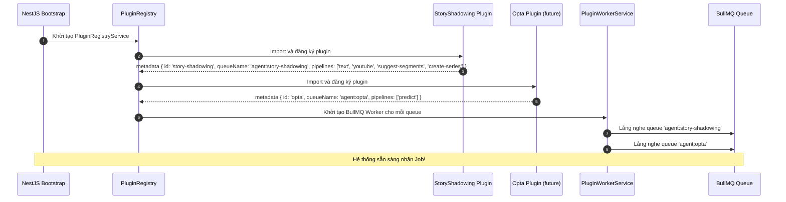
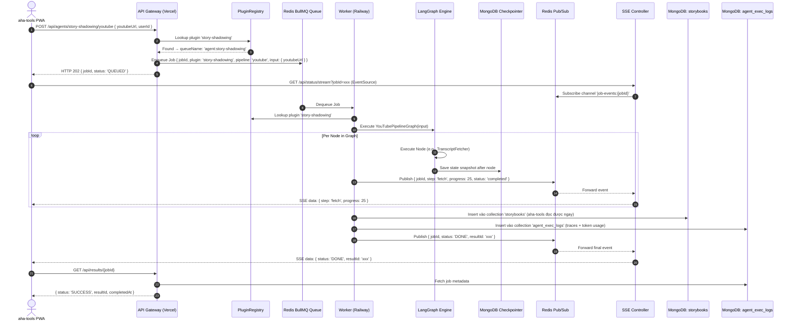
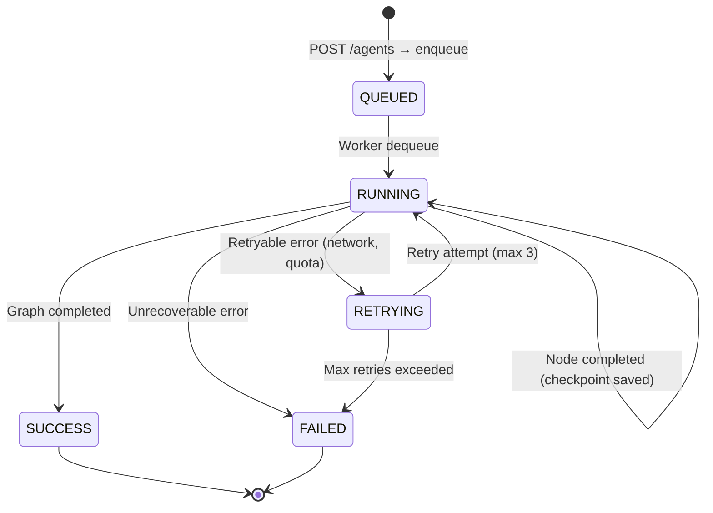
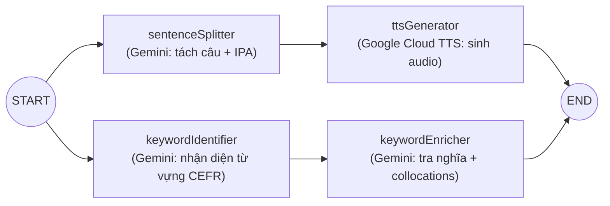
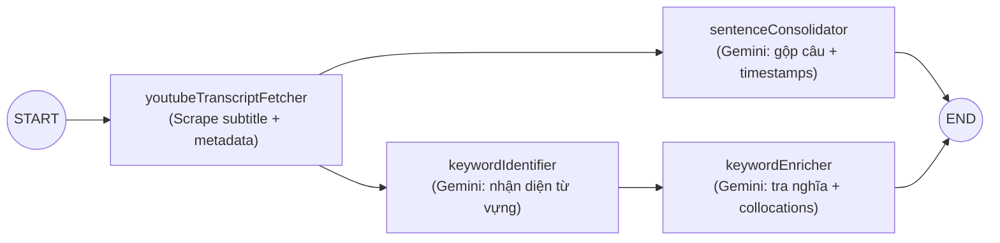
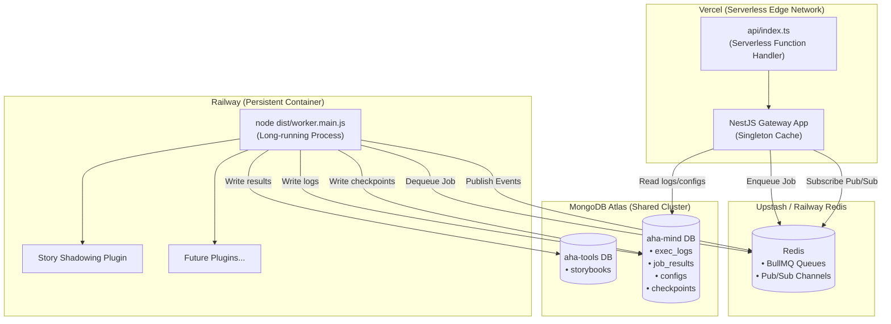

# System Design: aha-mind-agents

> **Tài Liệu Kiến Trúc Kỹ Thuật (Technical Architecture Document)**
> Hệ thống Backend độc lập quản lý, điều phối và thực thi Multi-Agent Workflows
> theo mô hình Plugin Architecture.

---

## 1. Tổng Quan Hệ Thống (System Overview)

### 1.1. Mục đích

`aha-mind-agents` là **backend engine độc lập**, tách biệt khỏi aha-tools PWA, đảm nhận toàn bộ việc:
- Tiếp nhận yêu cầu xử lý Agent từ bất kỳ client nào (aha-tools, mobile app, CLI, 3rd-party)
- Điều phối thực thi các Agent Pipeline (LangGraph State Machine)
- Quản lý cấu hình Agent động (system prompt, model, temperature)
- Giám sát vận hành (Observability): logs, traces, token usage, cost

### 1.2. Nguyên Tắc Thiết Kế (Design Principles)

| Nguyên tắc | Ý nghĩa trong hệ thống |
| :--- | :--- |
| **Plugin Architecture** | Mỗi Agent Engine là một Plugin độc lập, đăng ký vào Core Framework qua Registry Pattern. Thêm Agent mới = thêm 1 thư mục plugin, không sửa code core. |
| **Separation of Concerns** | API Gateway (nhận request) hoàn toàn tách biệt Worker Pool (thực thi). Giao tiếp duy nhất qua Redis Queue. |
| **Fail-fast & Resilient** | Kiểm tra cấu hình lúc boot. Worker tự retry với exponential backoff. Checkpoint mỗi bước để khôi phục khi lỗi. |
| **Stateless Gateway** | Gateway không giữ trạng thái nào. Mọi state nằm trong Redis Queue + MongoDB. Phù hợp triệt để với Serverless. |
| **Shared-Nothing Workers** | Mỗi Worker instance xử lý job độc lập, không chia sẻ bộ nhớ. Horizontal scaling = thêm Worker instance. |

---

## 2. Kiến Trúc Tổng Thể (High-Level Architecture)

```
┌──────────────────────────────────────────────────────────────────────────────────┐
│                        CONSUMERS (Client Applications)                          │
│   ┌──────────────────┐    ┌──────────────────┐    ┌──────────────────┐          │
│   │  aha-tools PWA   │    │   Mobile App     │    │  Admin Dashboard │          │
│   │  (Next.js)       │    │   (Future)       │    │  (/dashboard)    │          │
│   └────────┬─────────┘    └────────┬─────────┘    └────────┬─────────┘          │
└────────────┼──────────────────────┼──────────────────────┼──────────────────────┘
             │ HTTP POST            │ HTTP POST            │ HTTP GET
             │ + SSE Subscribe      │ + SSE Subscribe      │
─────────────┼──────────────────────┼──────────────────────┼──────────────────────
             ▼                      ▼                      ▼
┌──────────────────────────────────────────────────────────────────────────────────┐
│                   API GATEWAY (NestJS → Vercel Serverless)                       │
│                                                                                  │
│   ┌──────────────┐  ┌──────────────┐  ┌──────────────┐  ┌──────────────┐        │
│   │ AgentsCtrl   │  │ StatusCtrl   │  │ ResultsCtrl  │  │ DashboardCtrl│        │
│   │ POST /agents │  │ GET /status  │  │ GET /results │  │ GET /dashboard│       │
│   │ → enqueue    │  │ → SSE stream │  │ → fetch data │  │ → metrics    │        │
│   └──────┬───────┘  └──────┬───────┘  └──────┬───────┘  └──────┬───────┘        │
│          │                 │                 │                 │                  │
│          │    ┌─────────────────────────────────┐              │                  │
│          │    │    Agent Plugin Registry        │              │                  │
│          │    │    (Resolve agent → queue name)  │              │                  │
│          │    └─────────────────────────────────┘              │                  │
└──────────┼─────────────────┼─────────────────┼────────────────┼──────────────────┘
           │                 │                 │                │
───────────┼─────────────────┼─────────────────┼────────────────┼──────────────────
           ▼                 ▼                                  │
┌──────────────────────────────────────┐                        │
│        REDIS (Upstash / Railway)     │                        │
│                                      │                        │
│   ┌────────────────────────────────┐ │                        │
│   │ BullMQ Job Queues              │ │                        │
│   │  • agent:story-shadowing      │ │                        │
│   │  • agent:opta (future)        │ │                        │
│   │  • agent:general (future)     │ │                        │
│   └────────────────────────────────┘ │                        │
│   ┌────────────────────────────────┐ │                        │
│   │ Pub/Sub Channels               │ │                        │
│   │  • job-events:{jobId}          │ │                        │
│   └────────────────────────────────┘ │                        │
└──────────────────┬───────────────────┘                        │
                   │                                            │
───────────────────┼────────────────────────────────────────────┼──────────────────
                   ▼                                            │
┌──────────────────────────────────────────────────────────────────────────────────┐
│              WORKER POOL (Node.js Container → Railway/Render)                    │
│                                                                                  │
│   ┌────────────────────────────────────────────────────────────┐                 │
│   │              Agent Plugin Loader                           │                 │
│   │  (Auto-discover & register plugins from plugins/ dir)      │                 │
│   └──────────────────────────┬─────────────────────────────────┘                 │
│                              │                                                   │
│   ┌──────────────────────────┼─────────────────────────────────┐                 │
│   │ PLUGIN: Story Shadowing  │  PLUGIN: Opta (future)          │                 │
│   │ ┌──────────────────────┐ │  ┌──────────────────────┐       │                 │
│   │ │ StoryShadowingWorker │ │  │ OptaPredictorWorker  │       │                 │
│   │ │   ┌───────────────┐  │ │  │   (Placeholder)      │       │                 │
│   │ │   │ LangGraph     │  │ │  └──────────────────────┘       │                 │
│   │ │   │ State Machine │  │ │                                  │                 │
│   │ │   └───────────────┘  │ │                                  │                 │
│   │ └──────────────────────┘ │                                  │                 │
│   └──────────────────────────┴──────────────────────────────────┘                 │
│                              │                                                   │
│   ┌──────────────────────────┼─────────────────────────────────┐                 │
│   │           Shared Tool Gateway Layer                        │                 │
│   │  ┌──────────┐ ┌──────────┐ ┌──────────┐ ┌──────────┐      │                 │
│   │  │ Gemini   │ │ TTS      │ │ YouTube  │ │ Scraper  │      │                 │
│   │  │ Tool     │ │ Tool     │ │ Tool     │ │ Tool     │      │                 │
│   │  └──────────┘ └──────────┘ └──────────┘ └──────────┘      │                 │
│   └────────────────────────────────────────────────────────────┘                 │
└──────────────────────────────────────┬───────────────────────────────────────────┘
                                       │
───────────────────────────────────────┼───────────────────────────────────────────
                                       ▼
┌──────────────────────────────────────────────────────────────────────────────────┐
│                    MONGODB ATLAS (Shared Cluster)                                │
│                                                                                  │
│   Database: aha-tools (existing)     │  Database: aha-mind (new)                 │
│   ┌──────────────────────────────┐   │  ┌──────────────────────────────┐         │
│   │ Collection: storybooks       │   │  │ Collection: agent_exec_logs  │         │
│   │ (Kết quả bài học — write by  │   │  │ (Traces, token usage, cost)  │         │
│   │  worker, read by aha-tools)  │   │  ├──────────────────────────────┤         │
│   └──────────────────────────────┘   │  │ Collection: agent_job_results│         │
│                                      │  │ (Payload tạm, TTL 7 ngày)   │         │
│                                      │  ├──────────────────────────────┤         │
│                                      │  │ Collection: agent_configs    │         │
│                                      │  │ (Prompt, model per agent)    │         │
│                                      │  ├──────────────────────────────┤         │
│                                      │  │ Collection: agent_checkpoints│         │
│                                      │  │ (LangGraph state snapshots)  │         │
│                                      │  └──────────────────────────────┘         │
└──────────────────────────────────────────────────────────────────────────────────┘
```

---

## 3. Plugin Architecture (Thiết Kế Kiến Trúc Plugin)

### 3.1. Tại sao Plugin Architecture?

Hệ thống cần hỗ trợ **nhiều Agent Engine khác nhau** (Story Shadowing, Opta Predictor, General Agent, và các agent tương lai) mà không cần sửa đổi code core mỗi khi thêm agent mới.

### 3.2. Plugin Interface Contract

Mỗi Agent Plugin phải triển khai interface sau:

```typescript
// src/core/plugin.interface.ts

export interface AgentPluginMetadata {
  /** ID duy nhất của plugin, ví dụ: 'story-shadowing' */
  id: string;

  /** Tên hiển thị cho Dashboard */
  displayName: string;

  /** Mô tả ngắn gọn */
  description: string;

  /** Tên queue BullMQ mà plugin lắng nghe */
  queueName: string;

  /** Danh sách pipeline types mà plugin hỗ trợ */
  pipelines: string[];
}

export interface AgentPlugin {
  /** Metadata mô tả plugin */
  metadata: AgentPluginMetadata;

  /** Hàm xử lý Job — được Worker gọi khi dequeue */
  processJob(jobData: any, context: JobContext): Promise<any>;

  /** Hàm validate input trước khi enqueue */
  validateInput(pipelineType: string, input: any): ValidationResult;

  /** Trả về danh sách các bước (steps) của pipeline cho SSE progress tracking */
  getSteps(pipelineType: string): PipelineStep[];
}

export interface JobContext {
  jobId: string;
  userId?: string;
  /** Callback để phát tiến độ qua Redis Pub/Sub → SSE */
  publishProgress: (event: ProgressEvent) => Promise<void>;
  /** Checkpointer để lưu snapshot state */
  checkpointer: CheckpointerService;
  /** Logger để ghi vết execution */
  logger: ExecutionLogger;
}
```

### 3.3. Cấu Trúc Thư Mục Plugin

```
src/
├── core/
│   ├── plugin.interface.ts           # Contract interface cho mọi plugin
│   ├── plugin-registry.service.ts    # Registry quản lý đăng ký & lookup plugin
│   ├── tools/                        # Shared Tool Gateway (dùng chung cho mọi plugin)
│   │   ├── gemini.tool.ts
│   │   ├── tts.tool.ts
│   │   ├── youtube.tool.ts
│   │   └── scraper.tool.ts
│   └── state/
│       └── base.state.ts             # Base state schema (jobId, timestamps, error)
│
├── plugins/                          # <-- THƯ MỤC CHÍNH CHỨA CÁC AGENT PLUGINS
│   ├── story-shadowing/              # Plugin: Story Shadowing Engine
│   │   ├── index.ts                  # Export AgentPlugin implementation
│   │   ├── story-shadowing.plugin.ts # Triển khai AgentPlugin interface
│   │   ├── state/
│   │   │   ├── text.state.ts         # Zod schema cho Text Pipeline
│   │   │   └── youtube.state.ts      # Zod schema cho YouTube Pipeline
│   │   ├── graphs/
│   │   │   ├── text-pipeline.graph.ts
│   │   │   └── youtube-pipeline.graph.ts
│   │   ├── nodes/
│   │   │   ├── sentence-splitter.node.ts
│   │   │   ├── tts-generator.node.ts
│   │   │   ├── keyword-identifier.node.ts
│   │   │   ├── keyword-enricher.node.ts
│   │   │   ├── youtube-fetcher.node.ts
│   │   │   ├── youtube-consolidator.node.ts
│   │   │   └── youtube-suggester.node.ts
│   │   └── dto/
│   │       └── story-shadowing.dto.ts
│   │
│   └── opta/                         # Plugin: Opta Predictor (future)
│       ├── index.ts
│       ├── opta.plugin.ts
│       ├── state/
│       ├── graphs/
│       ├── nodes/
│       └── dto/
│
├── workers/                          # Worker Layer: auto-discover plugins
│   ├── workers.module.ts
│   └── plugin-worker.service.ts      # Generic worker nhận job → lookup plugin → thực thi
│
├── api/                              # API Gateway Layer
│   ├── agents/                       # Unified Agent endpoint
│   ├── status/                       # SSE streaming
│   ├── results/                      # Fetch results
│   └── dashboard/                    # Admin observability
│
└── infra/                            # Infrastructure services
    ├── database/
    ├── redis/
    └── storage/
```

### 3.4. Plugin Registration Flow



---

## 4. Data Flow Chi Tiết (Detailed Data Flow)

### 4.1. Luồng Chính: Client → Gateway → Queue → Worker → MongoDB



### 4.2. Sơ Đồ Trạng Thái Job (Job State Machine)



---

## 5. API Contract (Giao Diện Lập Trình Ứng Dụng)

### 5.1. Unified Agent Endpoint

Tất cả các agent plugin đều đi qua **một endpoint duy nhất** với dynamic routing.

#### POST `/api/agents/:agentId/:pipeline`

Nhận yêu cầu xử lý, validate input qua plugin, enqueue job, trả jobId ngay lập tức.

```
POST /api/agents/story-shadowing/text
POST /api/agents/story-shadowing/youtube
POST /api/agents/story-shadowing/suggest-segments
POST /api/agents/story-shadowing/create-series
POST /api/agents/opta/predict          (future)
POST /api/agents/general/run           (future)
```

**Request:**
```json
{
  "input": {
    "text": "The quick brown fox...",
    "voice": "en-US-Journey-F"
  },
  "userId": "user_123",
  "options": {
    "priority": "normal"
  }
}
```

**Response (HTTP 202 Accepted):**
```json
{
  "jobId": "job_abc123",
  "agentId": "story-shadowing",
  "pipeline": "text",
  "status": "QUEUED",
  "createdAt": "2026-08-08T12:00:00.000Z",
  "trackingUrl": "/api/status/stream?jobId=job_abc123"
}
```

### 5.2. SSE Status Stream

#### GET `/api/status/stream?jobId=:jobId`

Server-Sent Events stream cung cấp tiến độ thời gian thực.

**Events gửi về Client:**
```
event: progress
data: {"jobId":"job_abc123","step":"sentence_splitter","progress":25,"message":"Đã phân tách câu thành công","status":"completed"}

event: progress
data: {"jobId":"job_abc123","step":"tts_generator","progress":50,"message":"Đang tạo giọng đọc...","status":"running"}

event: done
data: {"jobId":"job_abc123","status":"DONE","resultId":"result_xyz"}

event: error
data: {"jobId":"job_abc123","status":"FAILED","error":"API Quota exhausted"}
```

### 5.3. Results Endpoint

#### GET `/api/results/:jobId`

Trả về metadata và trạng thái cuối cùng của Job.

**Response:**
```json
{
  "jobId": "job_abc123",
  "agentId": "story-shadowing",
  "pipeline": "text",
  "status": "SUCCESS",
  "createdAt": "2026-08-08T12:00:00.000Z",
  "completedAt": "2026-08-08T12:00:45.000Z",
  "durationMs": 45000,
  "result": {
    "storybookId": "669a...",
    "totalSentences": 5,
    "totalKeywords": 8
  }
}
```

### 5.4. Dashboard API

| Method | Endpoint | Mô tả |
| :--- | :--- | :--- |
| GET | `/api/dashboard/metrics` | Thống kê tổng: job count, success rate, avg latency, token cost |
| GET | `/api/dashboard/jobs` | Danh sách job phân trang với filter trạng thái & agent |
| GET | `/api/dashboard/jobs/:jobId/trace` | Chi tiết timeline từng node và error stacktrace |
| GET | `/api/dashboard/configs` | Liệt kê cấu hình tất cả agent plugins |
| PUT | `/api/dashboard/configs/:agentId` | Cập nhật system prompt, model, temperature |
| GET | `/api/dashboard/plugins` | Liệt kê tất cả plugin đã đăng ký và trạng thái |

---

## 6. Database Schema Chi Tiết

### 6.1. Chiến Lược Phân Chia Dữ Liệu

```
MongoDB Atlas Cluster (shared)
│
├── Database: aha-tools (existing, do aha-tools PWA sở hữu)
│   └── Collection: storybooks        ← Worker WRITE kết quả bài học vào đây
│                                         để aha-tools PWA đọc trực tiếp
│
└── Database: aha-mind (new, do aha-mind-agents sở hữu)
    ├── Collection: agent_exec_logs    ← Tracing & analytics
    ├── Collection: agent_job_results  ← Payload tạm (TTL 7 ngày)
    ├── Collection: agent_configs      ← Dynamic prompt & model config
    └── Collection: agent_checkpoints  ← LangGraph state snapshots
```

### 6.2. Schema: agent_exec_logs

```typescript
{
  _id: ObjectId,
  jobId: string,                        // UUID duy nhất của job
  agentId: string,                      // 'story-shadowing' | 'opta' | 'general'
  pipeline: string,                     // 'text' | 'youtube' | 'predict'
  userId: string | null,
  status: 'QUEUED' | 'RUNNING' | 'SUCCESS' | 'FAILED',

  // Timestamps
  queuedAt: Date,
  startedAt: Date | null,
  completedAt: Date | null,
  durationMs: number | null,

  // Token tracking
  tokenUsage: {
    promptTokens: number,
    completionTokens: number,
    totalTokens: number,
    estimatedCostUsd: number
  },

  // Per-node execution traces
  nodeTraces: [{
    nodeName: string,                   // 'sentenceSplitter', 'ttsGenerator'...
    startedAt: Date,
    completedAt: Date,
    durationMs: number,
    status: 'COMPLETED' | 'ERROR' | 'SKIPPED',
    tokenUsage?: { promptTokens, completionTokens },
    errorDetail?: string
  }],

  // Error info (nếu FAILED)
  error: {
    message: string,
    stack: string,
    retryCount: number
  } | null,

  // Index: { queuedAt: -1 } + { agentId: 1 } + TTL 90 ngày
}
```

### 6.3. Schema: agent_job_results

```typescript
{
  _id: ObjectId,
  jobId: string,
  agentId: string,
  pipeline: string,
  result: any,                          // Structured output (storybookId, totalSentences...)
  createdAt: Date,
  expiresAt: Date                       // TTL index: tự xóa sau 7 ngày
}
```

### 6.4. Schema: agent_configs

```typescript
{
  _id: ObjectId,
  agentId: string,                      // Unique index
  displayName: string,
  model: string,                        // 'gemini-2.5-flash' | 'gemini-2.5-pro'
  systemPrompt: string,                 // Dynamic system prompt cho agent
  temperature: number,                  // 0.0 - 1.0
  maxRetries: number,                   // Default: 3
  isActive: boolean,                    // Toggle on/off không cần redeploy
  updatedAt: Date,
  updatedBy: string
}
```

### 6.5. Schema: agent_checkpoints

```typescript
{
  _id: ObjectId,
  threadId: string,                     // = jobId
  checkpointId: string,                 // UUID per checkpoint
  parentCheckpointId: string | null,
  checkpoint: {                         // LangGraph checkpoint blob
    v: number,
    ts: string,
    channel_values: Record<string, any>,
    channel_versions: Record<string, number>,
    versions_seen: Record<string, Record<string, number>>
  },
  metadata: any,
  createdAt: Date
  // TTL index: 7 ngày (dọn dẹp tự động, chỉ cần trong lúc job chạy)
}
```

---

## 7. Component Diagram: Story Shadowing Plugin (Chi Tiết)

### 7.1. Text Pipeline Graph



**Đặc điểm:** Hai nhánh chạy song song (`sentenceSplitter + keywordIdentifier`), tối ưu tốc độ.

### 7.2. YouTube Pipeline Graph



**Đặc điểm:** Fetch tuần tự trước (cần transcript), sau đó 2 nhánh phân tích chạy song song.

---

## 8. Deployment Topology



### 8.1. Environment Variables Required

| Variable | Gateway (Vercel) | Worker (Railway) | Mô tả |
| :--- | :---: | :---: | :--- |
| `MONGODB_URI` | ✅ | ✅ | Connection string MongoDB Atlas |
| `REDIS_URL` | ✅ | ✅ | Redis cho BullMQ + Pub/Sub |
| `GOOGLE_API_KEY_1..N` | ❌ | ✅ | Gemini API Keys (chỉ Worker cần) |
| `GOOGLE_CLOUD_TTS_KEY` | ❌ | ✅ | Google Cloud TTS Key (chỉ Worker cần) |
| `PORT` | ❌ | ❌ | Vercel tự quản, Railway tự quản |
| `NODE_ENV` | ✅ | ✅ | 'production' / 'development' |
| `CRON_SECRET` | ✅ | ❌ | Bảo vệ Dashboard API |

---

## 9. Tác Động Đến implementation_plan.md Hiện Tại

So sánh giữa System Design mới (Plugin Architecture) và implementation_plan.md ban đầu:

| Khía cạnh | implementation_plan.md (ban đầu) | System Design (Plugin Architecture) | Cần cập nhật? |
| :--- | :--- | :--- | :---: |
| **Cấu trúc thư mục** | Graph nodes đặt trong `src/core/graph/` | Chuyển sang `src/plugins/story-shadowing/` | ✅ Cần sửa |
| **Worker** | Worker cụ thể cho từng agent (`story-shadowing.worker.ts`) | Worker generic (`plugin-worker.service.ts`) tự lookup plugin | ✅ Cần sửa |
| **API Endpoint** | Endpoint riêng cho từng agent | Unified endpoint `POST /agents/:agentId/:pipeline` | ✅ Cần sửa |
| **Database** | Chung 1 database | Tách 2 database: `aha-tools` (results) + `aha-mind` (logs, configs) | ✅ Cần sửa |
| **Deploy model** | Hybrid Vercel + Railway | Giữ nguyên | ❌ Không sửa |
| **Dashboard** | 3 màn hình | Giữ nguyên + thêm plugin list | ⚠️ Bổ sung nhỏ |
| **Checkpointer** | MongoDB checkpointer | Giữ nguyên | ❌ Không sửa |

---
*Made by Anh Tu - Share to be share*
